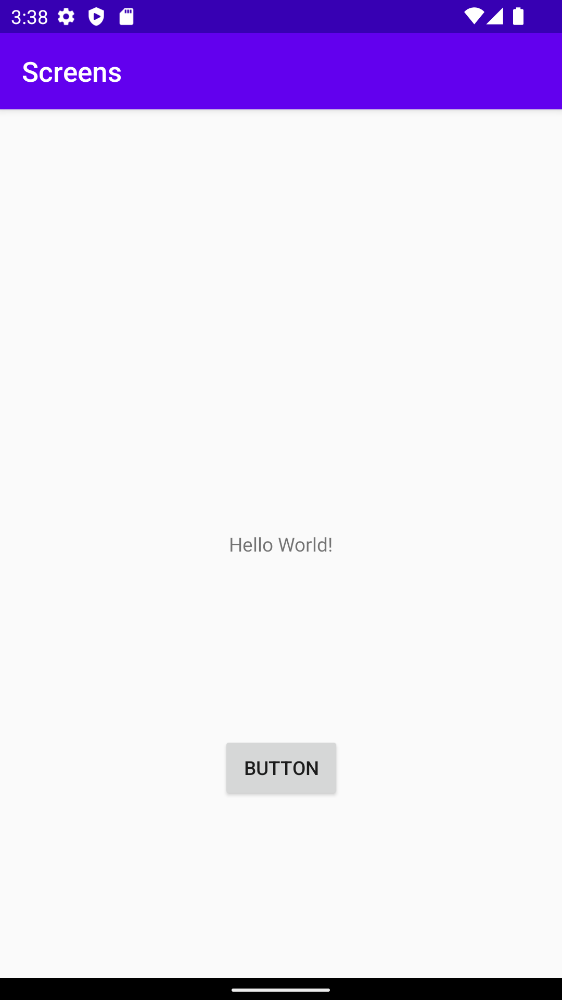
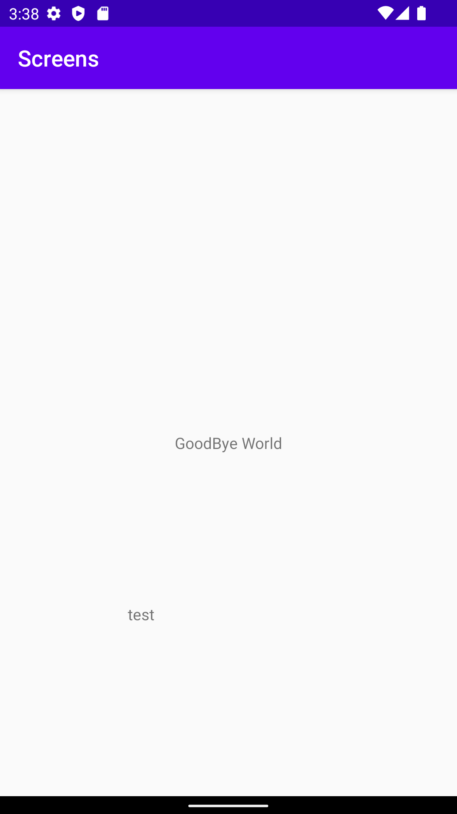

# Rapport

**Skriv din rapport här!**

I Began with creating a second activity which i called SecondActivity.
In the new activity i added a textview.
A button was added to the MainActivity which would allow the user to jump from main to second activity.
Code in main activity to allow user to transition to SecondActivity, along with extra data.
```
    public void nextActivity(View v)
    {
        Intent intent = new Intent(this, SecondActivity.class);
        intent.putExtra("username", "test");
        startActivity(intent);
    }
```
Lastly a new textview was created in SecondActivity to display the extra data that was received from MainActivity
Added code in second activity that show the extra data
```
 Intent intent = getIntent();
        String username = intent.getStringExtra("username");
        TextView tvUsername = findViewById(R.id.txt_username);
        tvUsername.setText(username);
```




